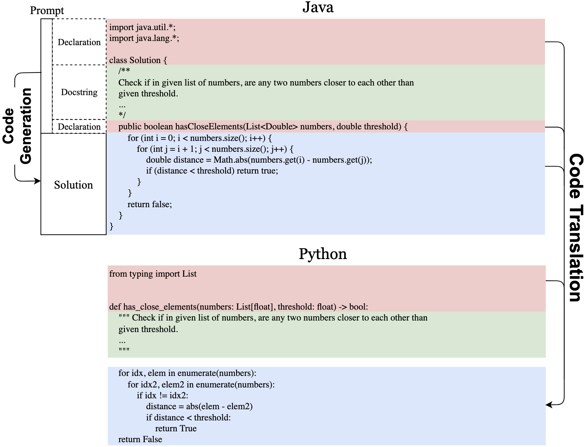
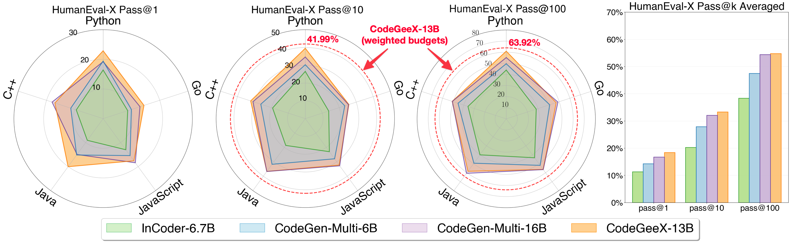
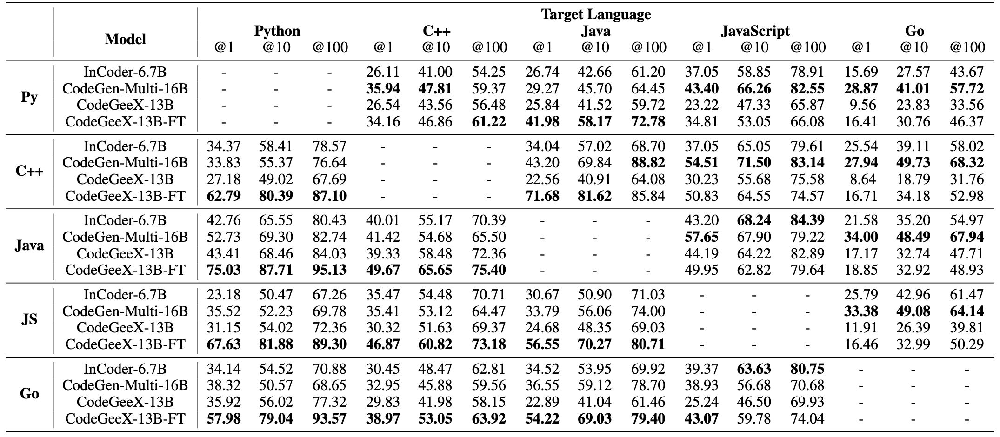
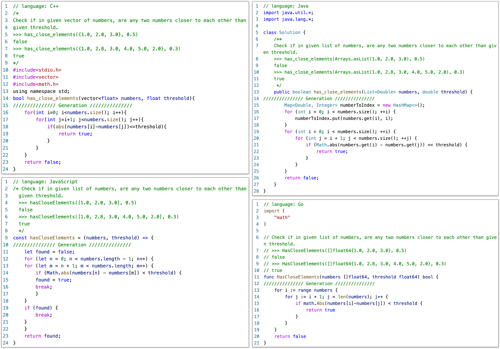

<p align="center">
    🏠 <a href="https://codegeex.cn" target="_blank">Homepage</a> | 📖 <a href="https://models.aminer.cn/codegeex/blog/" target="_blank">Blog</a> | 🪧 <a href="https://models.aminer.cn/codegeex/playground" target="_blank">DEMO</a> | 🤖 <a href="https://codegeex.cn/download/request" target="_blank">Download Model</a> | 📄 <a href="https://arxiv.org/abs/2303.17568" target="_blank">Paper</a> | 🌐 <a href="README_zh.md" target="_blank">中文</a>
</p>
<p align="center">
    🛠 <a href="https://marketplace.visualstudio.com/items?itemName=aminer.codegeex" target="_blank">VS Code</a>, <a href="https://plugins.jetbrains.com/plugin/20587-codegeex" target="_blank">Jetbrains</a>, <a href="https://plugins.jetbrains.com/plugin/20587-codegeex" target="_blank">Cloud Studio</a> supported | 👋 Join our <a href="https://discord.gg/8gjHdkmAN6" target="_blank">Discord</a>, <a href="https://join.slack.com/t/codegeexworkspace/shared_invite/zt-1s118ffrp-mpKKhQD0tKBmzNZVCyEZLw" target="_blank">Slack</a>, <a href="https://t.me/+IipIayJ32B1jOTg1" target="_blank">Telegram</a>, <a href="resources/zh/wechat.md"target="_blank">WeChat</a>
</p>


🌟 [CodeGeeX2](https://github.com/THUDM/CodeGeeX2) 已推出，更强，更快，更轻量。| [CodeGeeX2](https://github.com/THUDM/CodeGeeX2) has been released, more powerful, faster, and lightweight.

- [CodeGeeX: A Multilingual Code Generation Model](#codegeex-a-multilingual-code-generation-model)
  - [News](#news)
  - [Getting Started](#getting-started)
    - [Installation](#installation)
    - [Model Weights](#model-weights)
    - [Inference on GPUs](#inference-on-gpus)
    - [VS Code and Jetbrains Extension Guidance](#vs-code-and-jetbrains-extension-guidance)
  - [CodeGeeX: Architecture, Code Corpus, and Implementation](#codegeex-architecture-code-corpus-and-implementation)
  - [HumanEval-X: A new benchmark for Multilingual Program Synthesis](#humaneval-x-a-new-benchmark-for-multilingual-program-synthesis)
    - [Multilingual Code Generation](#multilingual-code-generation)
    - [Crosslingual Code Translation](#crosslingual-code-translation)
    - [How to use HumanEval-X and contribute to it?](#how-to-use-humaneval-x-and-contribute-to-it)
  - [License](#license)
  - [Citation](#citation)

# CodeGeeX: A Multilingual Code Generation Model

We introduce CodeGeeX, a large-scale multilingual code generation model with 13 billion parameters, pre-trained on a large code corpus of more than 20 programming languages. As of **June 22**, 2022, CodeGeeX has been trained on more than 850 billion tokens on a cluster of 1,536 [Ascend 910 AI Processors](https://e.huawei.com/en/products/servers/ascend). CodeGeeX has several unique features:
* **Multilingual Code Generation**: CodeGeeX has good performance for generating executable programs in several mainstream programming languages, including Python, C++, Java, JavaScript, Go, etc. [DEMO](https://models.aminer.cn/codegeex)
* **Crosslingual Code Translation**: CodeGeeX supports the translation of code snippets between different languages. Simply by one click, CodeGeeX can transform a program into any expected language with a high accuracy. [DEMO](https://models.aminer.cn/codegeex/codeTranslator)
* **Customizable Programming Assistant**: CodeGeeX is available in the VS Code extension marketplace **for free**. It supports code completion, explanation, summarization and more, which empower users with a better coding experience. [VS Code Extension](https://marketplace.visualstudio.com/items?itemName=aminer.codegeex)
* **Open-Source and Cross-Platform**: All codes and model weights are publicly available for research purposes. CodeGeeX supports both Ascend and NVIDIA platforms. It supports inference in a single Ascend 910, NVIDIA V100 or A100. [Apply Model Weights](https://models.aminer.cn/codegeex/download/request)

**HumanEval-X for Realistic Multilingual Benchmarking.** To help standardize the evaluation of multilingual code generation and translation, we develop and release the **HumanEval-X** Benchmark. HumanEval-X is a new multilingual benchmark that contains **820 human-crafted** coding problems in **5** programming languages (Python, C++, Java, JavaScript, and Go), each of these problems is associated with tests and solutions. [Usage](codegeex/benchmark/README.md)  [🤗 Available in HuggingFace](https://huggingface.co/datasets/THUDM/humaneval-x)


<p align="center"><i>CodeGeeX achieves the highest average performance compared with other open-sourced multilingual baselines.</i> </p>

## News

* 🌟 **2023-07-24**: [CodeGeeX2](https://github.com/THUDM/CodeGeeX2) has been released, more powerful, faster, and lightweight. Support 100+ languages and many new features.

* **2023-5-16**: CodeGeeX paper has been accepted by [KDD 2023, Long Beach](https://kdd.org/kdd2023/) and will be represented during the conference.

* **2023-03-30**: CodeGeeX paper is now available at [arxiv](https://arxiv.org/abs/2303.17568).

* **2023-02-14**: CodeGeeX now supports [Cloud Studio](https://cloudstudio.net/), a fantastic web IDE from Tencent. Click on the badge on top of this page to quickly launch an environment to test CodeGeeX.

* **2023-02-13**: Thanks a lot to [OneFlow](https://github.com/Oneflow-Inc/oneflow) team for adding oneflow backend for CodeGeeX's inference (Even faster than FasterTransformer under FP16!). Check more details [here](https://github.com/THUDM/CodeGeeX/pull/65).

* **2023-02**: We are hosting [CodeGeeX "Coding With AI" Hackathon](https://dorahacks.io/hackathon/codegeex/), design cool applications based on CodeGeeX and win prizes (RTX 4090, DJI drone, etc)!

* **2022-12-31**: We release the FasterTransformer version of CodeGeeX in [codegeex-fastertransformer](https://github.com/CodeGeeX/codegeex-fastertransformer). The INT8 accelerated version reaches an a verage speed of <15ms/token. Happy new year to everyone!

* **2022-12-13**: We release the source code of CodeGeeX VS Code extension in [codegeex-vscode-extension](https://github.com/CodeGeeX/codegeex-vscode-extension). Follow [QuickStart](https://github.com/CodeGeeX/codegeex-vscode-extension/blob/main/doc/quickstart.md) to start development.

* **2022-12-11**: CodeGeeX is now available for Jetbrains IDEs (IntelliJ IDEA, PyCharm, GoLand, CLion, etc), download it [here](https://plugins.jetbrains.com/plugin/20587-codegeex).

* **2022-12-04**: We release source code of quantization (requires less GPU RAM: 27GB -> 15GB) and model parallelism (possible to run on multiple GPUs with <8G RAM).
 
* **2022-09-30**: We release the cross-platform source code and models weights for both Ascend and NVIDIA platforms.

## Getting Started

CodeGeeX is initially implemented in Mindspore and trained Ascend 910 AI Processors. We provide a torch-compatible version based on [Megatron-LM](https://github.com/NVIDIA/Megatron-LM) to facilitate usage on GPU platforms.
### Installation

Python 3.7+ / CUDA 11+ / PyTorch 1.10+ / DeepSpeed 0.6+ are required. Install ``codegeex`` package via: 
```bash
git clone git@github.com:THUDM/CodeGeeX.git
cd CodeGeeX
pip install -e .
```
Or use [CodeGeeX docker](https://hub.docker.com/r/codegeex/codegeex) to quickly set up the environment (with [nvidia-docker](https://docs.nvidia.com/datacenter/cloud-native/container-toolkit/install-guide.html#docker) installed):
```bash
docker pull codegeex/codegeex:latest
# To enable GPU support, clarify device ids with --device
docker run --gpus '"device=0,1"' -it --ipc=host --name=codegeex codegeex/codegeex
```

### Model Weights

Apply and download model weights through this [link](https://models.aminer.cn/codegeex/download/request). You'll receive by mail ```urls.txt``` that contains temporary download links. We recommend you to use [aria2](https://aria2.github.io/) to download it via the following command (Please make sure you have enough disk space to download the checkpoint (~26GB)):
```bash
aria2c -x 16 -s 16 -j 4 --continue=true -i urls.txt 
```
Run the following command to get the full model weights:
```bash
cat codegeex_13b.tar.gz.* > codegeex_13b.tar.gz
tar xvf codegeex_13b.tar.gz
```

### Inference on GPUs

Have a try on generating the first program with CodeGeeX. First, specify the path of the model weights in ``configs/codegeex_13b.sh``. Second, write the prompt (natural language description or code snippet) into a file, e.g., ``tests/test_prompt.txt``, then run the following script:
```bash
# On a single GPU (with more than 27GB RAM)
bash ./scripts/test_inference.sh <GPU_ID> ./tests/test_prompt.txt

# With quantization (with more than 15GB RAM)
bash ./scripts/test_inference_quantized.sh <GPU_ID> ./tests/test_prompt.txt

# On multiple GPUs (with more than 6GB RAM, need to first convert ckpt to MP_SIZE partitions)
bash ./scripts/convert_ckpt_parallel.sh <LOAD_CKPT_PATH> <SAVE_CKPT_PATH> <MP_SIZE>
bash ./scripts/test_inference_parallel.sh <MP_SIZE> ./tests/test_prompt.txt
```

### VS Code and Jetbrains Extension Guidance

Based on CodeGeeX, we also develop free extentions for VS Code and Jetbrains IDEs, and more in the future. 

For VS Code, search "codegeex" in Marketplace or install it [here](https://marketplace.visualstudio.com/items?itemName=aminer.codegeex). Detailed instructions can be found in 
[VS Code Extension Guidance](vscode-extension/README.md). For developers, we have also released the source code in [codegeex-vscode-extension](https://github.com/CodeGeeX/codegeex-vscode-extension), please follow [QuickStart](https://github.com/CodeGeeX/codegeex-vscode-extension/blob/main/doc/quickstart.md) to start development.

For Jetbrains IDEs, search "codegeex" in Plugins or install it [here](https://plugins.jetbrains.com/plugin/20587-codegeex). 
Make sure your IDE version is 2021.1 or later. CodeGeeX now supports IntelliJ IDEA, PyCharm, GoLand, CLion, Android Studio, AppCode, Aqua, DataSpell, DataGrip, Rider, RubyMine, and WebStorm. 

## CodeGeeX: Architecture, Code Corpus, and Implementation

**Architecture**: CodeGeeX is a large-scale pre-trained programming language model based on transformers. It is a left-to-right autoregressive decoder, which takes code and natural language as input and predicts the probability of the next token. CodeGeeX contains 40 transformer layers with a hidden size of 5,120 for self-attention blocks and 20,480 for feed-forward layers, making its size reach 13 billion parameters. It supports a maximum sequence length of 2,048.


<p align="center"><i><b>Left:</b> the proportion of programming languages in CodeGeeX's training data. 
  <b>Right:</b> the plot of training loss against the training steps of CodeGeeX.</i></p>

**Code Corpus**: Our training data contains two parts. The first part is from open-sourced code datasets, [The Pile](https://pile.eleuther.ai/) and [CodeParrot](https://github.com/huggingface/transformers/tree/main/examples/research_projects/codeparrot). The Pile contains a subset of code corpus that collects public repositories with more than 100 stars from GitHub, from which we select codes in 23 popular programming languages. The second part is supplementary data directly scrapped from the public GitHub repositories that do not appear in previous datasets, including Python, Java and C++. To obtain data of potentially higher quality, repositories with at least one star and its size smaller than 10MB are chosen. A file is filtered out if it 1) has more than 100 characters per line on average, 2) is automatically generated, 3) has a ratio of alphabet less than 40%, or 4) is bigger than 100KB or smaller than 1KB. To help the model distinguish different languages, we add a language-specific prefix at the beginning of each segment in the form of ``[Comment sign] language: [LANG]``, e.g., ``# language: Python``. For tokenization, we use the same tokenizer as GPT-2 and process whitespaces as extra tokens, resulting in a vocabulary of 50,400 tokens. In total, the code corpus has 23 programming languages with 158.7B tokens.

**Training**: We implement CodeGeeX in [Mindspore 1.7](https://www.mindspore.cn/) and train it on 1,536 Ascend 910 AI Processor (32GB). The model weights are under FP16 format, except that we use FP32 for layer-norm and softmax for higher precision and stability. The entire model consumes about 27GB of memory. To increase the training efficiency, we adopt an 8-way model parallel training together with 192-way data parallel training, with ZeRO-2 optimizer enabled. The micro-batch size is 16 and the global batch size reaches 3,072. Moreover, we adopt techniques to further boost the training efficiency including the element-wise operator fusion, fast gelu activation, matrix multiplication dimension optimization, etc. The entire training process takes nearly two months, spanning from April 18 to June 22, 2022, during which 850B tokens were passed for training, i.e., 5+ epochs.

## HumanEval-X: A new benchmark for Multilingual Program Synthesis
To better evaluate the multilingual ability of code generation models, we propose a new benchmark HumanEval-X. While previous works evaluate multilingual program synthesis under semantic similarity (e.g., [CodeBLEU](https://arxiv.org/abs/2009.10297)) which is often misleading, HumanEval-X evaluates the functional correctness of the generated programs. HumanEval-X consists of 820 high-quality human-crafted data samples (each with test cases) in Python, C++, Java, JavaScript, and Go, and can be used for various tasks.



<p align="center"><i>An illustration of tasks supported by <b>HumanEval-X</b>. Declarations, docstrings, and solutions are marked with red, green, and blue respectively. <b>Code generation</b> uses declaration and docstring as input, to generate solution. <b>Code translation</b> uses declaration in both languages and translate the solution in source language to the one in target language.</i></p>

In HumanEval-X, every sample in each language contains declaration, docstring, and solution, which can be combined in various ways to support different downstream tasks including generation, translation, summarization, etc. We currently focus on two tasks: **code generation** and **code translation**. For code generation, the model uses declaration and docstring as input to generate the solution. For code translation, the model uses declarations in both languages and the solution in the source language as input, to generate solutions in the target language. We remove the description during code translation to prevent the model from directly solving the problem. For both tasks, we use the unbiased pass@k metric proposed in [Codex](https://arxiv.org/abs/2107.03374): $\text{pass}@k:= \mathbb{E}[1-\frac{\tbinom{n-c}{k}}{\tbinom{n}{k}}]$, with $n=200$ and $k\in(1,10,100)$.

### Multilingual Code Generation


<p align="center"><i><b>Left</b>: the detailed pass@k (k=1,10,100) performance on code generation task for five languages in HumanEval-X. <b>Right</b>: the average performance of all languages of each model. CodeGeeX achieves the highest average performance compared with InCoder-6.7B, CodeGen-Multi-6B and CodeGen-Multi-16B.</i></p>


We compare CodeGeeX with two other open-sourced code generation models, [InCoder](https://github.com/dpfried/incoder) (from Meta) and [CodeGen](https://github.com/salesforce/CodeGen) (from Salesforce). Specifically, InCoder-6.7B, CodeGen-Multi-6B and CodeGen-Multi-16B are considered. CodeGeeX significantly outperforms models with smaller scales (by 7.5%~16.3%) and is competitive with CodeGen-Multi-16B with a larger scale (average performance 54.76% vs. 54.39%). CodeGeeX achieves the best average performance across languages.

### Crosslingual Code Translation



<p align="center"><i>Results on HumanEval-X <b>code translation</b> task. Best language-wise performance are <b>bolded</b>.</i></p>

We also evaluate the performance of translation across different programming languages. We test the zero-shot performance of CodeGeeX, as well as the fine-tuned CodeGeeX-13B-FT (fine-tuned using the training set of code translation tasks in [XLCoST](https://github.com/reddy-lab-code-research/XLCoST); Go is absent in the original set, we thus add a small set to it). The results indicate that models have a preference for languages, e.g., CodeGeeX is good at translating other languages to Python and C++, while CodeGen-Multi-16B is better at translating to JavaScript and Go; these could probably be due to the difference in language distribution in the training corpus. Among 20 translation pairs, we also observe that the performance of A-to-B and B-to-A are always negatively correlated, which might indicate that the current models are still not capable of learning all languages well. 

### How to use HumanEval-X and contribute to it?

For more details on how to use HumanEval-X, please see [usage](codegeex/benchmark/README.md). We highly welcome the community to contribute to HumanEval-X by adding more problems or extending it to other languages, please check out the [standard format](codegeex/benchmark/README.md#how-to-use-humaneval-x) of HumanEval-X and add a pull request. 

Please kindly let us know if you have any comment or suggestion, via [codegeex@aminer.cn](mailto:codegeex@aminer.cn).

<details>
<summary><b>Examples of Generation</b></summary>

</details>

<details>
<summary><b>Acknowledgement</b></summary>
<br/>
This project is supported by the National Science Foundation for Distinguished Young Scholars (No. 61825602). 

### Lead Contributors

Qinkai Zheng ([Tsinghua KEG](http://keg.cs.tsinghua.edu.cn/glm-130b/)), Xiao Xia (Tsinghua KEG), Xu Zou (Tsinghua KEG)

### Contributors

Tsinghua KEG---The Knowledge Engineering Group at Tsinghua: Aohan Zeng, Wendi Zheng, Lilong Xue

Zhilin Yang's Group at Tsinghua IIIS: Yifeng Liu, Yanru Chen,  Yichen Xu (BUPT, work was done when visiting Tsinghua)

Peng Cheng Laboratory: Qingyu Chen, Zhongqi Li, Gaojun Fan

Zhipu\.AI: Yufei Xue, Shan Wang, Jiecai Shan, Haohan Jiang, Lu Liu, Xuan Xue, Peng Zhang

Ascend and Mindspore Team: Yifan Yao, Teng Su, Qihui Deng, Bin Zhou

### Data Annotations

Ruijie Cheng (Tsinghua), Peinan Yu (Tsinghua), Jingyao Zhang (Zhipu\.AI), Bowen Huang (Zhipu\.AI), Shaoyu Wang (Zhipu\.AI) 
    
### Advisors

[Zhilin Yang](https://kimiyoung.github.io/) (Tsinghua IIIS), Yuxiao Dong (Tsinghua KEG), Wenguang Chen (Tsinghua PACMAN), Jie Tang (Tsinghua KEG)
    

### Computation Sponsors

[Peng Cheng Laboratory](https://www.pcl.ac.cn/index.html)

[Zhipu.AI](https://www.zhipu.ai/)---an AI startup that aims to teach machines to think like humans

### Project Leader 

[Jie Tang](http://keg.cs.tsinghua.edu.cn/jietang/) (Tsinghua KEG & BAAI)
</details>

## License

Our code is licensed under the [Apache-2.0 license](LICENSE).
Our model is licensed under the [license](MODEL_LICENSE).

## Citation

If you find our work useful, please cite:

```
@misc{zheng2023codegeex,
      title={CodeGeeX: A Pre-Trained Model for Code Generation with Multilingual Evaluations on HumanEval-X}, 
      author={Qinkai Zheng and Xiao Xia and Xu Zou and Yuxiao Dong and Shan Wang and Yufei Xue and Zihan Wang and Lei Shen and Andi Wang and Yang Li and Teng Su and Zhilin Yang and Jie Tang},
      year={2023},
      eprint={2303.17568},
      archivePrefix={arXiv},
      primaryClass={cs.LG}
}
```
