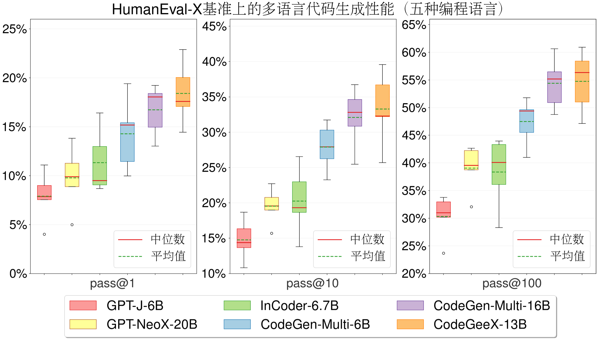
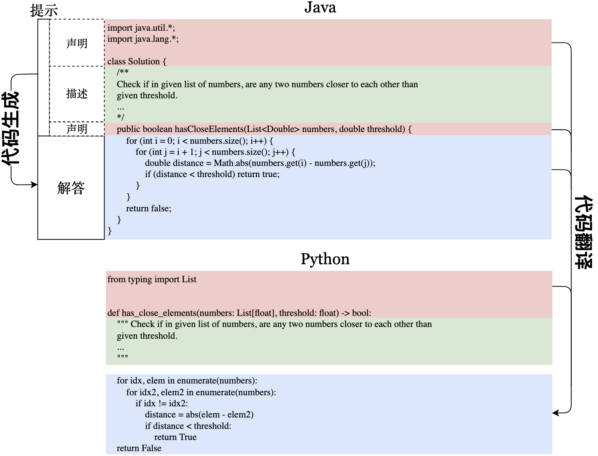
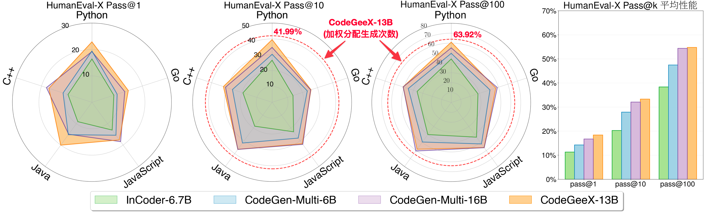
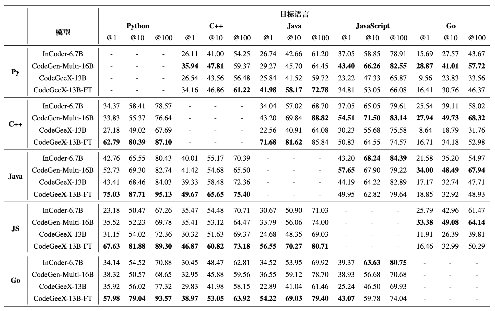

<p align="center">
    🏠 <a href="https://models.aminer.cn/codegeex/zh-CN" target="_blank">主页</a> | 📖 <a href="https://models.aminer.cn/codegeex/blog/index_zh.html" target="_blank">博客</a> | 🪧 <a href="https://models.aminer.cn/codegeex/zh-CN/playground" target="_blank">示例</a> | 🤖 <a href="https://models.aminer.cn/codegeex/download/request" target="_blank">模型下载</a> | 📄 <a href="https://arxiv.org/abs/2303.17568" target="_blank">论文</a> | 🌐 <a href="https://github.com/THUDM/CodeGeeX/blob/main/README.md" target="_blank">English</a>
</p>
<p align="center">
    🛠 <a href="https://marketplace.visualstudio.com/items?itemName=aminer.codegeex" target="_blank">VS Code</a>, <a href="https://plugins.jetbrains.com/plugin/20587-codegeex" target="_blank">Jetbrains</a>, <a href="https://plugins.jetbrains.com/plugin/20587-codegeex" target="_blank">Cloud Studio</a> 插件 | 👋 欢迎加入 <a href="resources/zh/wechat.md"target="_blank">微信开发者交流群</a> 
</p>

🌟 [CodeGeeX2](https://github.com/THUDM/CodeGeeX2) 已推出，更强，更快，更轻量。

- [CodeGeeX: 多语言代码生成模型](#codegeex-多语言代码生成模型)
  - [新闻](#新闻)
  - [使用指南](#使用指南)
    - [安装](#安装)
    - [模型权重](#模型权重)
    - [用GPU进行推理](#用gpu进行推理)
    - [插件使用指南](#插件使用指南)
  - [CodeGeeX: 多语言代码生成模型](#codegeex-多语言代码生成模型-1)
    - [国产平台实现与训练](#国产平台实现与训练)
  - [HumanEval-X: 多语言代码生成基准](#humaneval-x-多语言代码生成基准)
    - [多语言代码生成](#多语言代码生成)
    - [跨语言代码翻译](#跨语言代码翻译)
  - [许可证](#许可证)
  - [引用](#引用)
# CodeGeeX: 多语言代码生成模型

CodeGeeX是一个具有130亿参数的多编程语言代码生成预训练模型。CodeGeeX采用华为MindSpore框架实现，在鹏城实验室“鹏城云脑II”中的192个节点（共1536个国产[昇腾910 AI处理器](https://e.huawei.com/cn/products/servers/ascend)）上训练而成。截至2022年6月22日，CodeGeeX历时两个月在20多种编程语言的代码语料库（>8500亿Token）上预训练得到。CodeGeeX有以下特点：
* **高精度代码生成**：支持生成Python、C++、Java、JavaScript和Go等多种主流编程语言的代码，在HumanEval-X代码生成任务上取得47%~60%求解率，较其他开源基线模型有更佳的平均性能。[代码生成示例](https://models.aminer.cn/codegeex/zh-CN)
* **跨语言代码翻译**：支持代码片段在不同编程语言间进行自动翻译转换，翻译结果正确率高，在HumanEval-X代码翻译任务上超越了其它基线模型。[代码翻译示例](https://models.aminer.cn/codegeex/zh-CN/codeTranslator)
* **自动编程插件**：CodeGeeX插件现已上架VSCode插件市场（完全免费），用户可以通过其强大的少样本生成能力，自定义代码生成风格和能力，更好辅助代码编写。[插件下载](https://marketplace.visualstudio.com/items?itemName=aminer.codegeex)
* **模型跨平台开源**: 所有代码和模型权重开源开放，用作研究用途。CodeGeeX同时支持昇腾和英伟达平台，可在单张昇腾910或英伟达V100/A100上实现推理。[申请模型权重](https://models.aminer.cn/codegeex/download/request)

**全新多编程语言评测基准HumanEval-X**：HumanEval-X是第一个支持功能正确性评测的多语言、多任务的基准，包含820个人工编写的高质量代码生成题目、测试用例与参考答案，覆盖5种编程语言（Python、C++、Java、JavaScript、Go），支持代码生成与代码翻译能力的评测。[如何使用](codegeex/benchmark/README_zh.md)



<p align="center"><i>在HumanEval-X代码生成任务上，与其它开源基线模型相比，CodeGeeX取得了最佳的平均性能。</i> </p>

## 新闻

* 🌟 **2023-07-24**: [CodeGeeX2](https://github.com/THUDM/CodeGeeX2) 已推出，更强，更快，更轻量。支持超过100种语言，并具有多种新特性。

* **2023-5-16**: CodeGeeX 论文已被 [KDD 2023, Long Beach](https://kdd.org/kdd2023/) 接收，并将在会上做相关报告。

* **2023-03-30**: CodeGeeX 论文已发表在[arxiv](https://arxiv.org/abs/2303.17568)。

* **2023-02-14**: CodeGeeX 现已支持 [Cloud Studio](https://cloudstudio.net/), 一款腾讯推出、十分好用的在线编辑器。单击此页面顶部的徽章可快速启动环境测试 CodeGeeX。

* **2023-02-13**: 感谢 [OneFlow](https://github.com/Oneflow-Inc/oneflow) 加入了oneflow版推理支持，在FP16下比FasterTransformer还要快！更多优化细节请点击[这里](https://github.com/THUDM/CodeGeeX/pull/65).

* **2023-02**: [CodeGeeX "Coding With AI"黑客松](https://dorahacks.io/hackathon/codegeex/)正在进行中，为CodeGeeX设计应用并赢取奖品（RTX 4090、DJI无人机等）！

* **2022-12-31**: 我们在 [codegeex-fastertransformer](https://github.com/CodeGeeX/codegeex-fastertransformer) 中发布了 CodeGeeX 的 FasterTransformer 版本。INT8加速版本达到 <15ms/token 的平均速度。祝大家新年快乐！

* **2022-12-13**: 我们开源了VS Code插件源码：[codegeex-vscode-extension](https://github.com/CodeGeeX/codegeex-vscode-extension)，参考 [QuickStart](https://github.com/CodeGeeX/codegeex-vscode-extension/blob/main/doc/quickstart.md) 开始开发吧！

* **2022-12-11**: CodeGeeX for Jetbrains IDEs已上线，支持IntelliJ IDEA, PyCharm, GoLand, CLion等，[点击下载](https://plugins.jetbrains.com/plugin/20587-codegeex)。
  
* **2022-12-04**: 我们开源了量化代码（需要更少的显存：27GB -> 15GB）以及模型并行代码（可以运行在多个显存至少8GB的GPUs上）。

* **2022-09-30**: 我们开源了跨平台代码和模型权重，同时支持昇腾和英伟达平台。
## 使用指南

CodeGeeX最初使用Mindspore框架实现，并在昇腾910AI芯片上进行训练。为适配更多平台，我们将其转换到[Megatron-LM](https://github.com/NVIDIA/Megatron-LM)框架，支持Pytorch+GPU环境。
### 安装

需要Python 3.7+ / CUDA 11+ / PyTorch 1.10+ / DeepSpeed 0.6+，通过以下命令安装 ``codegeex``: 
```bash
git clone git@github.com:THUDM/CodeGeeX.git
cd CodeGeeX
pip install -e .
```

### 模型权重

通过[该链接](https://models.aminer.cn/codegeex/download/request)申请权重，您将收到一个包含临时下载链接文件```urls.txt```的邮件。推荐使用[aria2](https://aria2.github.io/)通过以下命令快速下载（请保证有足够的硬盘空间存放权重（～26GB））：
```bash
aria2c -x 16 -s 16 -j 4 --continue=true -i urls.txt 
``` 
使用以下命令合并得到完整的权重：
```bash
cat codegeex_13b.tar.gz.* > codegeex_13b.tar.gz
tar xvf codegeex_13b.tar.gz
```

### 用GPU进行推理

尝试使用CodeGeeX模型生成第一个程序吧！首先，在配置文件``configs/codegeex_13b.sh``中写明存放权重的路径。其次，将提示（可以是任意描述或代码片段）写入文件``tests/test_prompt.txt``，运行以下脚本即可开始推理（需指定GPU序号）：
```bash
# On a single GPU (with more than 27GB RAM)
bash ./scripts/test_inference.sh <GPU_ID> ./tests/test_prompt.txt

# With quantization (with more than 15GB RAM)
bash ./scripts/test_inference_quantized.sh <GPU_ID> ./tests/test_prompt.txt

# On multiple GPUs (with more than 6GB RAM, need to first convert ckpt to MP_SIZE partitions)
bash ./scripts/convert_ckpt_parallel.sh <LOAD_CKPT_PATH> <SAVE_CKPT_PATH> <MP_SIZE>
bash ./scripts/test_inference_parallel.sh <MP_SIZE> ./tests/test_prompt.txt
```

### 插件使用指南

基于CodeGeeX，我们开发了免费的插件，支持 VS Code 与 Jetbrains IDEs，未来会支持更多平台。

VS Code版本，在应用市场搜索“codegeex”或通过[该链接](https://marketplace.visualstudio.com/items?itemName=aminer.codegeex)安装。详细的使用指南在[CodeGeeX VS Code插件使用指南](vscode-extension/README_zh.md)。我们也开源了VS Code插件源码：[codegeex-vscode-extension](https://github.com/CodeGeeX/codegeex-vscode-extension)，参考[QuickStart](https://github.com/CodeGeeX/codegeex-vscode-extension/blob/main/doc/quickstart_zh.md) 开始开发吧！

Jetbrains版本，在Plugins市场搜索“codegeex”或通过[该链接](https://plugins.jetbrains.com/plugin/20587-codegeex)安装。
请确保IDE版本在2021.1或更高。CodeGeeX目前支持 IntelliJ IDEA, PyCharm, GoLand, CLion, Android Studio, AppCode, Aqua, DataSpell, DataGrip, Rider, RubyMine, WebStorm。 

## CodeGeeX: 多语言代码生成模型

**架构**：CodeGeeX是一个基于transformers的大规模预训练编程语言模型。它是一个从左到右生成的自回归解码器，将代码或自然语言标识符（token）作为输入，预测下一个标识符的概率分布。CodeGeeX含有40个transformer层，每层自注意力块的隐藏层维数为5120，前馈层维数为20480，总参数量为130亿。模型支持的最大序列长度为2048。


<p align="center"><i><b>左侧：</b>CodeGeeX训练数据中各编程语言占比。
<b>右侧：</b>CodeGeeX训练损失函数随训练步数下降曲线。</i></p>

**语料**：CodeGeeX的训练语料由两部分组成。第一部分是开源代码数据集，[The Pile](https://pile.eleuther.ai/) 与 [CodeParrot](https://github.com/huggingface/transformers/tree/main/examples/research_projects/codeparrot)。The Pile包含GitHub上拥有超过100颗星的一部分开源仓库，我们从中选取了23种编程语言的代码。第二部分是补充数据，直接从GitHub开源仓库中爬取Python、Java、C++代码；为了获取高质量数据，我们根据以下准则选取代码仓库：1)至少拥有1颗星；2)总大小<10MB；3)不在此前的开源代码数据集中。我们还去掉了符合下列任一条件的文件：1)平均每行长度大于100字符；2)由自动生成得到；3)含有的字母不足字母表内的40%；4)大于100KB或小于1KB。为了让模型区分不同语言，我们在每个样本的开头加上一个前缀，其形式为``[注释符] language: [语言]``，例如：``# language: Python``。我们使用与GPT-2相同的分词器，并将空格处理为特殊标识符，词表大小为50400。整个代码语料含有23种编程语言、总计1587亿个标识符（不含填充符）。

### 国产平台实现与训练
我们在[Mindspore 1.7](https://www.mindspore.cn/)框架上实现了CodeGeeX模型，并使用鹏城实验室的全国产计算平台上进行训练。具体来说，CodeGeeX使用了其一个计算集群中的1536个昇腾910 AI处理器（32GB）进行了两个月左右的训练（2022年4月18日至6月22日）。除了Layer-norm与Softmax使用FP32格式以获得更高的精度与稳定性，模型参数整体使用FP16格式，最终整个模型需要占用约27GB显存。为了增加训练效率，我们使用8路模型并行和192路数据并行的训练策略，微批大小为16、全局批大小为3072，并采用ZeRO-2优化器降低显存占用。

在开发与训练过程中，我们和华为Mindspore团队合作，对MindSpore框架进行了部分优化，进而大幅度提升训练效率。比如，我们发现矩阵乘法的计算时间占比仅为22.9%，大量时间被用于各类其它算子，因此实现了一系列算子融合，包括单元素算子融合、层归一化算子融合、FastGelu与矩阵乘法融合、批量矩阵乘法与加法融合等；再比如我们还对矩阵乘法算子的维度实现自动搜索调优，使其搜索出效率最高的计算维度组合。这些优化为训练速度带来了显著提升，在同等GPU卡数规模下（128卡），昇腾910对CodeGeeX这一模型的训练效率从约为NVIDIA A100的16.7%提升至43%；在千卡规模下，昇腾910训练效率相比自身优化前提升近300%。使用优化后的软硬件训练时，CodeGeeX单日训练量可达到54.3B个标识符（含填充符），证明了国产深度学习平台与工具的快速迭代能力以及强大竞争力。

## HumanEval-X: 多语言代码生成基准
为了更好地评测代码生成模型的多语言生成能力，我们构建了一个新基准HumanEval-X。此前，多语言代码生成能力是基于语义相似度（比如[CodeBLEU](https://arxiv.org/abs/2009.10297)）衡量的，具有一定误导性；HumanEval-X则可用于衡量生成代码的功能正确性。HumanEval-X包含820个高质量手写样本，覆盖Python、C++、Java、JavaScript、Go，可用于多种任务。



<p align="center"><i><b>HumanEval-X</b>支持的任务示例。<font style='background-color:#F8CECC'>声明</font>、<font style='background-color:#D5E8D4'>描述</font>、<font style='background-color:#DAE8FC'>解答</font>分别用红、绿、蓝色标注。<i>代码生成</i>将声明与描述作为输入，输出解答。<i>代码翻译</i>将两种语言的声明与源语言的解答作为输入，输出目标语言的解答。</i></p>

HumanEval-X中每个语言的样本，包含了声明、描述和解答，它们之间的组合可以支持不同的下游任务，包括生成、翻译、概括等。我们目前关注两个任务：**代码生成**与**代码翻译**。对于代码生成任务，模型将函数声明与文档字符串作为输入，输出函数实现；对于代码翻译任务，模型将两种语言的函数声明与源语言的实现作为输入，输出目标语言上的实现。我们在代码翻译任务中不将文档字符串输入模型，以避免模型直接通过描述生成答案。在两种任务下，我们都采用[Codex](https://arxiv.org/abs/2107.03374)所使用的无偏pass@k指标，判断生成代码的功能正确性: $\text{pass}@k:= \mathbb{E}[1-\frac{\tbinom{n-c}{k}}{\tbinom{n}{k}}]$, $n=200$, $k\in(1,10,100)$.

### 多语言代码生成



<p align="center"><i><b>左侧</b>: HumanEval-X中五种语言具体的pass@k（k=1,10,100）性能。<b>右侧</b>: 模型在所有语言上的平均性能。CodeGeeX的平均表现优于InCoder-6.7B和CodeGen-Multi-6B/16B。</i></p>


我们将CodeGeeX与另外两个开源代码生成模型进行比较，分别为Meta的[InCoder](https://github.com/dpfried/incoder)与Salesforce的[CodeGen](https://github.com/salesforce/CodeGen)，选取InCoder-6.7B、CodeGen-Multi-6B 与 CodeGen-Multi-16B。CodeGeeX能获得最佳的平均性能，显著超越了参数量更小的模型(7.5%~16.3%的提升)，与参数量更大的模型CodeGen-Multi-16B表现相当（平均性能 54.76% vs. 54.39%）。

### 跨语言代码翻译



<p align="center"><i>HumanEval-X上的<b>代码翻译</b>任务结果。<b>加粗</b>结果表示在每种语言pass@k上的最佳效果。</i></p>

我们还评测了模型在多语言间代码翻译上的性能。对于CodeGeeX，我们评测了未经微调的CodeGeeX-13B与经过微调的CodeGeeX-13B-FT（使用[XLCoST](https://github.com/reddy-lab-code-research/XLCoST)中代码翻译任务的训练集与一部分Go语言数据微调）。如上表显示，模型对特定语言存在偏好，比如CodeGeeX擅长将其他语言翻译为Python与C++，而CodeGen-Multi-16B擅长翻译为JavaScript和Go，这可能是由于训练集中的语料占比存在差异。在20个翻译对中，我们还观察到两种语言互相翻译的表现常常是呈负相关的，这可能说明现有的模型还不足以学好所有的语言。


<details> 
<summary><b>在线生成与翻译DEMO</b></summary>

我们为上述两个任务开发了DEMO：<a href="https://models.aminer.cn/codegeex/zh-CN/playground" target="_blank">代码生成</a>和<a href="https://models.aminer.cn/codegeex/zh-CN/codeTranslator" target="_blank">代码翻译</a>，欢迎点击体验！
</details>

<details>
<summary><b>致谢</b></summary>
<br/>
这一项目由国家自然科学基金杰出青年科学基金项目（No. 61825602）支持。
​    

#### 学生负责人

郑勤锴（[清华大学知识工程实验室](https://keg.cs.tsinghua.edu.cn/glm-130b/zh/posts/glm-130b/)），夏箫（清华大学知识工程实验室），邹旭（清华大学知识工程实验室）
    
#### 技术贡献

清华大学知识工程实验室：曾奥涵，郑问迪，薛理龙

清华大学交叉信息学院：刘益枫，陈彦儒，徐奕辰（北邮大四访问清华期间研究工作）

鹏城实验室：陈庆玉，李忠琦，范高俊

智谱AI：薛宇飞，王山，陕杰才，姜皓瀚，刘璐，薛旋，张鹏

华为昇腾团队：姚逸璠，苏腾，邓启辉，周斌

#### 数据标注
程锐杰（清华大学），于沛楠（清华大学），张竞尧（智谱AI），黄铂文（智谱AI），王炤宇（智谱AI）
    
#### 指导教师

[杨植麟](https://kimiyoung.github.io/)（清华大学交叉信息学院），东昱晓（清华大学知识工程实验室），陈文光（清华大学PACMAN实验室），[唐杰](http://keg.cs.tsinghua.edu.cn/jietang/)（清华大学知识工程实验室）
    

#### 计算资源支持

[鹏城实验室](https://www.pcl.ac.cn/index.html)

[智谱AI](https://www.zhipu.ai/)

#### 项目总负责

[唐杰](http://keg.cs.tsinghua.edu.cn/jietang/)（清华大学知识工程实验室 & 北京智源人工智能研究院）
</details>

如果遇到问题或有任何建议，欢迎通过邮件与我们联系[codegeex@aminer.cn](mailto:codegeex@aminer.cn).

## 许可证

代码使用[Apache-2.0许可证](LICENSE)
模型使用[许可证](MODEL_LICENSE)

## 引用

如果觉得我们的工作有帮助，欢迎引用以下论文：

```
@misc{zheng2023codegeex,
      title={CodeGeeX: A Pre-Trained Model for Code Generation with Multilingual Evaluations on HumanEval-X}, 
      author={Qinkai Zheng and Xiao Xia and Xu Zou and Yuxiao Dong and Shan Wang and Yufei Xue and Zihan Wang and Lei Shen and Andi Wang and Yang Li and Teng Su and Zhilin Yang and Jie Tang},
      year={2023},
      eprint={2303.17568},
      archivePrefix={arXiv},
      primaryClass={cs.LG}
}
```