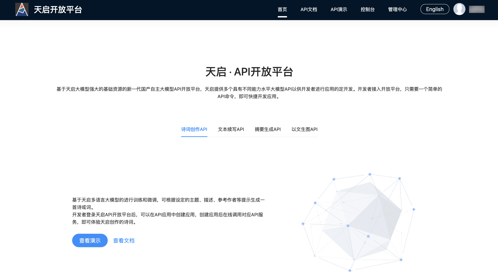
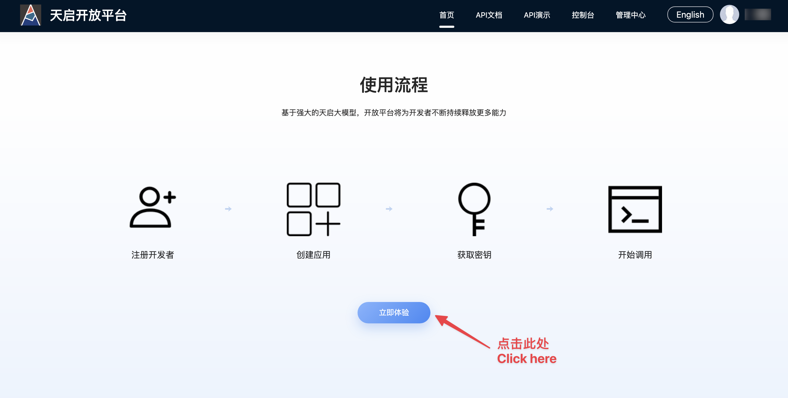
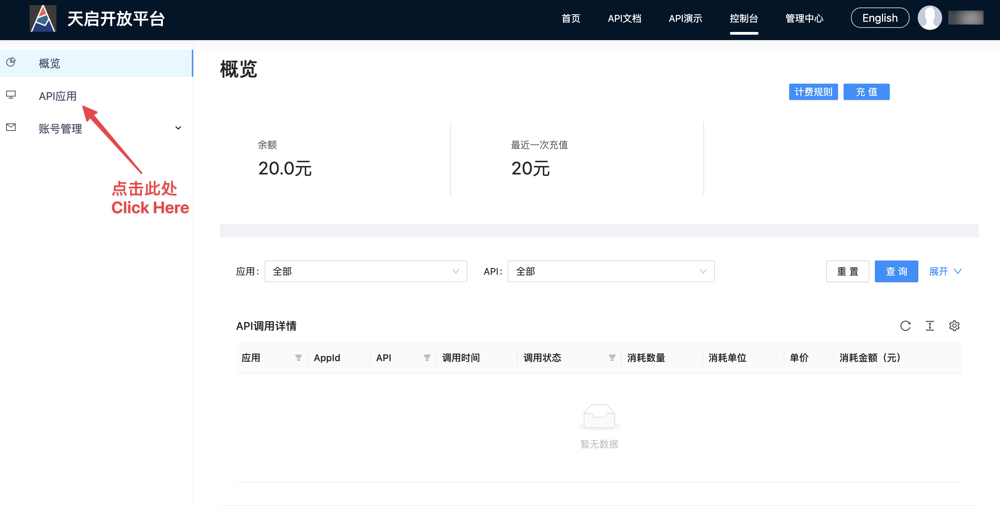
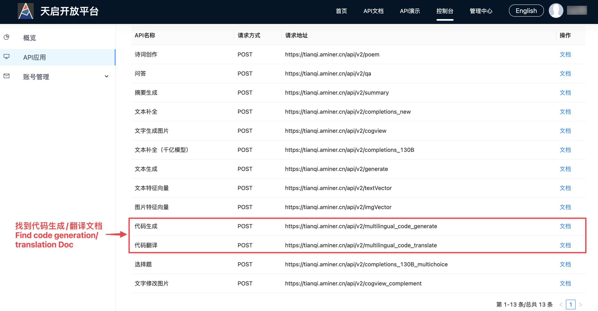

# 创建CodeGeeX API

使用[天启 · API开放平台](https://tianqi.aminer.cn/open/)申请CodeGeeX API：

点击首页中的天启平台体验入口：

点击API应用：

输入任意名称，创建API应用。创建后会得到API Key/Secret，用于调用API：

在API信息中，可以查看代码生成/代码翻译的请求地址和使用文档：

根据文档中的描述使用API，Python版参考目录``api/codegeex-api-example-python``；JAVA版参考工程：``api/codegeex-api-example-java``
